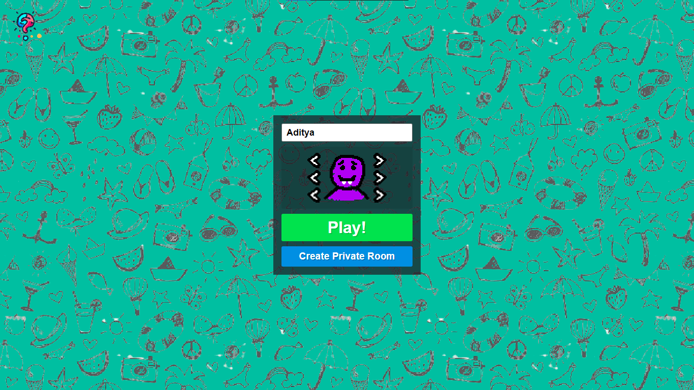
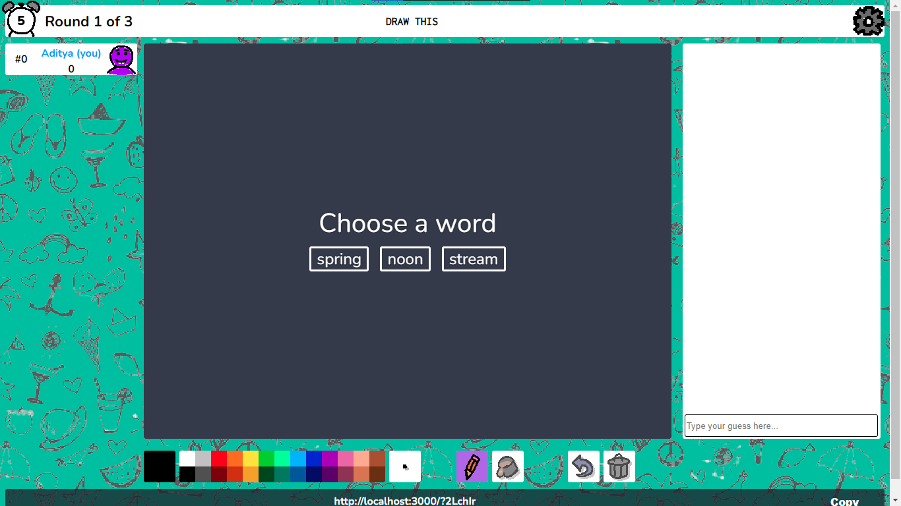
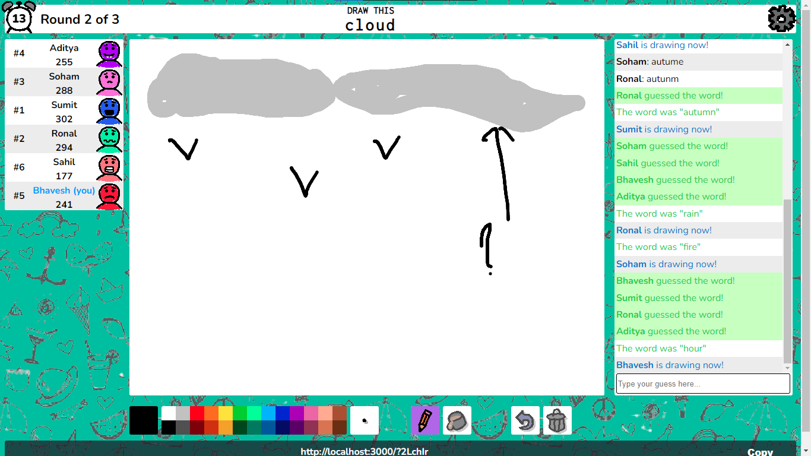
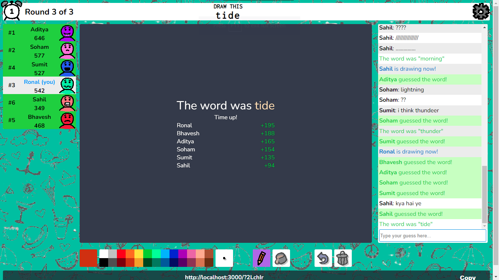
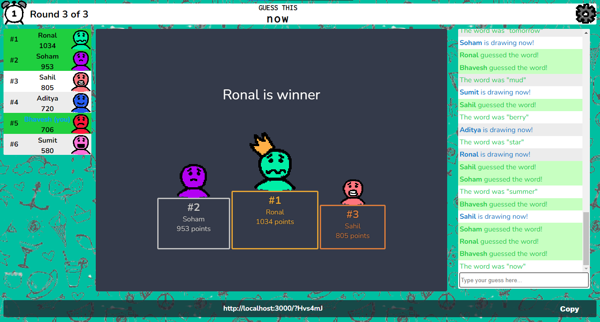

<center>

<p style='font-weight: bold; font-size: 1.5em; font-family: cursive;'>Sketch.io</p>
</center>
   
_ _ _

### <p>About Sketch.io<p/>

<p>
Sketch.io is a multiplayer drawing game. It is a clone of the popular game Skribbl.io. It is built using React, Node.js, Express.js and Socket.io.
</p>

#### How to play

To play the game, you have to click on **play** button or you can also create your private room by clicking on **Create Private Room** button to play the game.After that game will appear on the screen and you can share the room link with your friends and ask them to join the room. Once the room is created, the game will start. One player will be selected as the drawer and the other players will be the guessers. The drawer will have to draw the word and the guessers will have to guess the word. The player who guesses the word correctly will get a point. The player with the most points till the end that player will be the winner of the game.

<!-- </div> -->

### Installation

Clone the repository using the following command:

```bash
git clone git@github:ADITYAbasude/Sketch.io.git
```

To run the project, you will need to have Node.js installed on your system. You can download Node.js from [here](https://nodejs.org/en/download/). After installing Node.js, you will need to install the dependencies. To install the dependencies, open the terminal in the project directory and run the following command:

```bash
cd ./frontend
npm install
cd ./backend
npm install
```

After installing the dependencies, you will need to start the server. To start the server, run the following command:

```bash
cd ./backend
npm start
```

After starting the server, you will need to start the frontend. To start the frontend, run the following command:

```bash
cd ./frontend
npm start
```

After that, open the browser and go to <a href='http://localhost:3000'>http://localhost:3000</a>. You will see the dashboard of the game.

### <p style='font-family: cursive;'>`Screenshots`</p>

<center>

    
    

    
    

    
    

    
    

</center>
